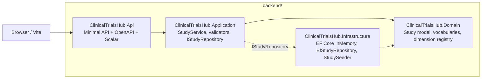

# Backend architecture (.NET 10)

This document describes the **current** ASP.NET Core backend under `backend/`. It replaces the earlier Go-centric description: the Go implementation now lives only under `backend-go-backup/` as a read-only behavioral reference.

For product-level intent and capability links, see `openspec/changes/port-backend-to-dotnet/` (for example `proposal.md` and `specs/`).

---

## 1. High-level layout

**Dependency rule:** Domain has no project references. Application references Domain only. Infrastructure references Application + Domain (to implement the repository and host EF mappings). Api references Application + Infrastructure for composition.

**EF Core boundary:** No `Microsoft.EntityFrameworkCore` imports appear in Domain or Application source (`.cs`); EF types and `DbContext` live only in Infrastructure.

---

## 2. Projects (hexagonal)

| Project | Responsibility |
|---------|----------------|
| **Domain** | `Study`, `StudyDraft`, eligibility types, `EligibilityDimensionRegistry`, `Vocabularies`. No infrastructure attributes on domain types. |
| **Application** | DTOs, `StudyService`, FluentValidation validators, `IStudyRepository`, mapping, application exceptions. |
| **Infrastructure** | `ClinicalTrialsDbContext`, EF configurations, `EfStudyRepository` (sequential `study-NNNN` IDs with a concurrency gate), `StudySeeder`, `SeedStartupHostedService`. |
| **Api** | `Program.cs` composition root: JSON options (`UnmappedMemberHandling.Disallow`), CORS, health + study + eligibility routes, `GlobalExceptionHandler`, native OpenAPI + Scalar. |
| **ClinicalTrialsHub.Tests** | Domain, application, infrastructure, and HTTP integration tests (`WebApplicationFactory`). |

---

## 3. HTTP surface

| Method | Path | Notes |
|--------|------|--------|
| GET | `/health` | JSON `{ "status": "ok" }` (via health checks + custom writer). |
| GET | `/api/eligibility-dimensions` | Registry payload under `data`. Non-GET methods on the same path return **405**. |
| GET/POST | `/api/studies` | List / create. |
| GET/PUT | `/api/studies/{id}` | Read / full replace. |
| PUT | `/api/studies/{id}/eligibility` | Inclusion/exclusion only. |

Errors match the legacy contract: validation **400** with `{ "message": "validation failed", "errors": { ... } }`, JSON issues **400** with `{ "message": "invalid JSON payload" }`, missing resources **404** with `{ "message": "<resource> not found" }`.

---

## 4. OpenAPI stack

- **Runtime:** `Microsoft.AspNetCore.OpenApi` — `AddOpenApi` + `MapOpenApi()` → `/openapi/v1.json`.
- **Interactive UI:** `Scalar.AspNetCore` → `/scalar/v1` (document URL pattern aligned with OpenAPI route).
- **Build-time artifact:** `Microsoft.Extensions.ApiDescription.Server` writes under `backend/docs/`; `openapi.json` is kept in sync for tooling.

Swashbuckle is intentionally not used.

---

## 5. Persistence and testing

- **Provider:** EF Core InMemory (`Persistence:InMemoryDatabaseName` in configuration; default `clinical-trials-hub`).
- **Seeding:** `SeedStartupHostedService` ensures the database exists, then runs `StudySeeder` when the store is empty.
- **Tests:** Repository tests use a fresh database name per fixture; integration tests set `Persistence:InMemoryDatabaseName` via `WebApplicationFactory` host settings for isolation.

---

## 6. Deployment

- **Container:** `backend/Dockerfile` — multi-stage SDK 10 / ASP.NET 10 runtime, port **8080**.
- **Fly.io:** `backend/fly.toml` — internal port 8080, HTTP check on `/health`. CORS origins are expected via secrets (see `fly.toml` comments).

---

## 7. Legacy reference

`backend-go-backup/` remains until the .NET backend is fully validated in production; it is not part of the active build. See the OpenSpec change log in `openspec/changes/port-backend-to-dotnet/proposal.md`.
