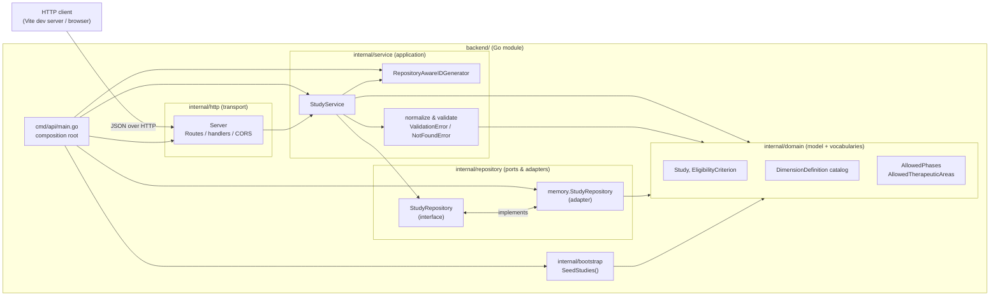
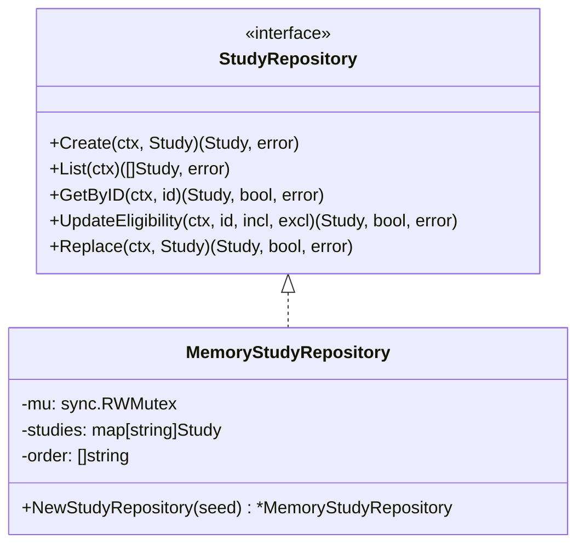
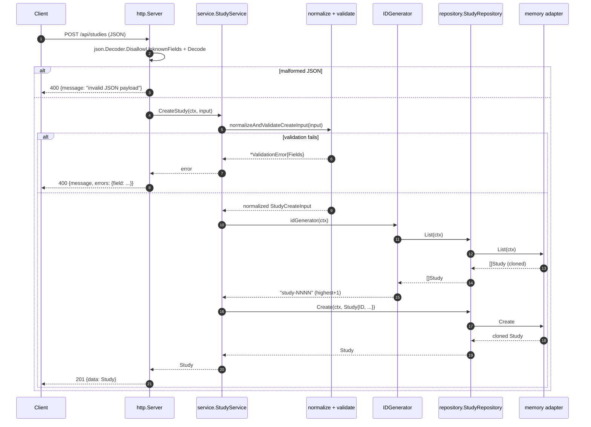
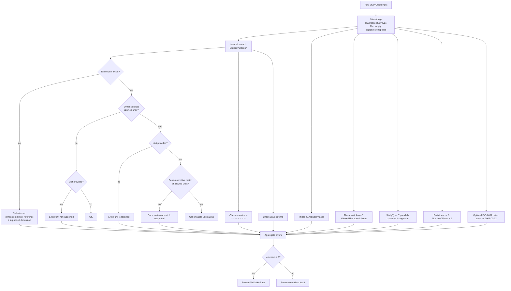
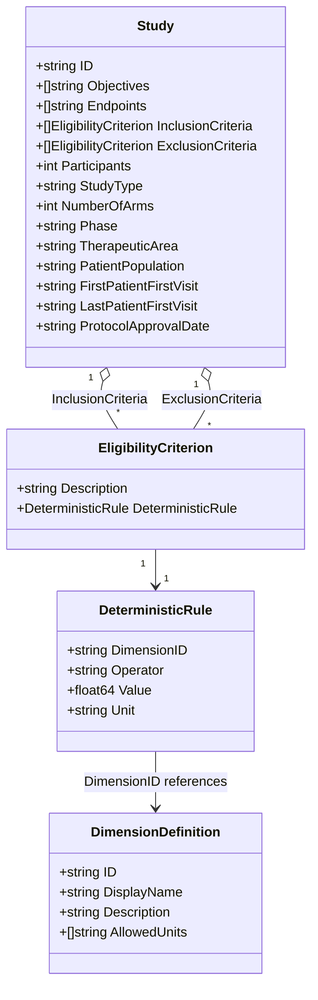
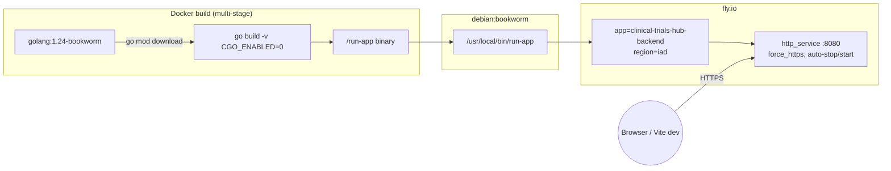

# Backend Architecture

This document describes the architecture of the Go backend that powers the
Clinical Trials Hub POC. It complements [`design-decisions.md`](design-decisions.md)
(which records the *why* of the broader POC) by focusing on the *how* of the
backend: layers, data flow, validation, persistence, and deployment.

The backend is intentionally small and dependency-free: it is a single
`net/http` server with an in-memory repository. Every boundary, however, is
shaped so that the layers below can be replaced (Postgres, different transport,
etc.) without touching the domain or HTTP handlers.

---

## 1. High-level view

The service is a classic four-layer hexagonal-ish layout, entered from
`cmd/api/main.go` and wired by constructor injection.



The arrows are deliberately one-directional: `http` depends on `service`,
`service` depends on `repository` (via the port) and `domain`, and nothing in
`domain` depends on anything else. `cmd/api` is the only place that knows the
concrete adapter wiring.

---

## 2. File tree

```text
backend/
├── cmd/
│   └── api/
│       └── main.go                              # composition root; boots HTTP server
├── internal/
│   ├── bootstrap/
│   │   ├── seed.go                              # hand-curated Study catalog
│   │   └── seed_test.go                         # asserts integrity of seed data
│   ├── domain/
│   │   ├── study.go                             # Study + closed vocabularies
│   │   ├── eligibility.go                       # EligibilityCriterion + dimensions
│   │   └── eligibility_test.go
│   ├── http/
│   │   ├── server.go                            # routes, handlers, CORS, JSON I/O
│   │   └── server_test.go                       # end-to-end HTTP tests
│   ├── repository/
│   │   ├── repository.go                        # StudyRepository port (interface)
│   │   ├── repository_contract_test.go          # adapter-agnostic contract test
│   │   └── memory/
│   │       └── study_repository.go              # in-memory adapter (RWMutex)
│   └── service/
│       ├── study_service.go                     # use cases + validation pipeline
│       ├── study_service_test.go
│       ├── id_generator_test.go
│       └── (RepositoryAwareIDGenerator lives in study_service.go)
├── go.mod                                       # standard library only
├── Dockerfile                                   # multi-stage build, CGO_ENABLED=0
└── fly.toml                                     # Fly.io deployment config
```

Things worth noting from the tree:

- No third-party dependencies (see `go.mod`). Routing is plain
  `http.ServeMux`, JSON is `encoding/json`, concurrency uses `sync.RWMutex`.
- The only package allowed outside `internal/` is `cmd/api`, which enforces
  that nothing imports the backend as a library.
- Tests live next to the code they cover, plus one *contract* test under
  `repository/` that any future adapter (Postgres) must pass.

---

## 3. Package responsibilities

### 3.1 `cmd/api` — composition root

```go
repository   := memory.NewStudyRepository(bootstrap.SeedStudies())
idGenerator  := service.NewRepositoryAwareIDGenerator("study", repository)
studyService := service.NewStudyService(repository, idGenerator)
server       := transport.NewServer(studyService)

http.ListenAndServe(":"+port, server.Routes())
```

All wiring is explicit. The order matters: the repository is seeded first so
the ID generator can read its current highest suffix, and the service is given
both collaborators through its constructor.

### 3.2 `internal/domain` — model and vocabularies

`domain` owns:

- `Study`, `StudyCreateInput`, `StudyEligibilityInput` (DTOs with JSON tags).
- `EligibilityCriterion` and `DeterministicRule` — the shape of an eligibility
  rule is a *description* plus a machine-readable `{dimensionId, operator,
  value, unit}` triplet.
- `DimensionDefinition` catalog — the 22 supported clinical dimensions with
  their allowed units (e.g. `hsCRP → [mg/L]`, `ECOG → []`). The catalog is
  exposed through `EligibilityDimensions()` and `LookupEligibilityDimension()`,
  both of which return defensive clones so callers can never mutate the
  package-level slice.
- `AllowedPhases` / `AllowedTherapeuticAreas` — closed vocabularies enforced
  during validation.

The domain package has **no imports from other internal packages**. It is the
stable core.

### 3.3 `internal/repository` — port + in-memory adapter

The port is deliberately narrow:

```go
type StudyRepository interface {
    Create(ctx, Study)                        (Study, error)
    List(ctx)                                 ([]Study, error)
    GetByID(ctx, id)                          (Study, bool, error)
    UpdateEligibility(ctx, id, incl, excl)    (Study, bool, error)
    Replace(ctx, Study)                       (Study, bool, error)
}
```

The `memory` adapter stores studies in `map[string]Study` plus an
`order []string` slice so `List` returns items in insertion order
(deterministic across runs, which matters for the frontend's similarity
ranking). Concurrent access is guarded by `sync.RWMutex`:



Every read/write goes through `cloneStudy` / `cloneEligibilityCriteria`. This
is the single most important invariant of the adapter: **no pointer into the
store ever escapes**, so callers cannot accidentally mutate stored data by
editing a returned slice.

`repository_contract_test.go` exercises any implementation of the port
against the same scenarios, which is how a future Postgres adapter will be
validated.

### 3.4 `internal/service` — use cases and validation

`StudyService` exposes the five application use cases the HTTP layer needs:

| Use case                   | Method                           | Key behavior                                                       |
|----------------------------|----------------------------------|--------------------------------------------------------------------|
| Register a study           | `CreateStudy`                    | normalize + validate, then allocate a fresh `study-NNNN` ID        |
| List registered studies    | `ListStudies`                    | read-through to the repository (already insertion-ordered)         |
| Fetch a study              | `GetStudyByID`                   | trims the ID and returns a `(study, found)` tuple                  |
| Replace a study            | `ReplaceStudy`                   | same validation as create; 404 when the ID does not exist          |
| Update eligibility only    | `UpdateStudyEligibility`         | validates only inclusion/exclusion criteria; preserves other fields |
| Expose dimension catalog   | `GetEligibilityDimensions`       | passes through the domain catalog (already defensively cloned)      |

Two typed errors are raised from here and propagated upward:

- `ValidationError{Fields map[string]string}` — carries field-level messages
  that the HTTP layer serializes as `{"errors": {...}}` alongside a `400`.
- `NotFoundError{Resource}` — translated to `404` by the HTTP layer.

The validation pipeline is the most substantive piece of logic in the
service and is discussed in detail in §5.

### 3.5 `internal/http` — transport

`Server` registers four routes on a stdlib `http.ServeMux`:

| Method | Path                              | Handler                        |
|--------|-----------------------------------|--------------------------------|
| GET    | `/health`                         | `handleHealth`                 |
| GET    | `/api/eligibility-dimensions`     | `handleEligibilityDimensions`  |
| GET    | `/api/studies`                    | `listStudies`                  |
| POST   | `/api/studies`                    | `createStudy`                  |
| GET    | `/api/studies/{id}`               | `getStudyByID`                 |
| PUT    | `/api/studies/{id}`               | `replaceStudy`                 |
| PUT    | `/api/studies/{id}/eligibility`   | `handleStudyEligibility`       |

Because the project targets Go 1.24 but uses the classic `ServeMux` pattern
(`/api/studies/`), the two sub-routes (`{id}` and `{id}/eligibility`) are
resolved by inspecting the suffix inside `handleStudyRoute`. This keeps the
router dependency-free while still giving clean URLs.

Cross-cutting behavior is minimal and explicit:

- `withCORS` middleware — permissive CORS for local and Fly.io-hosted
  consumption by the Vite frontend.
- `writeJSON` / `writeError` — single place responsible for setting
  `Content-Type` and serializing errors (`{"message", "errors"}`).
- `json.Decoder` is always configured with `DisallowUnknownFields()` so
  unexpected payload keys fail fast with a `400`.

Error translation is performed with `errors.As`, which keeps the service
layer free of HTTP concerns:

```go
var validationErr *service.ValidationError
if errors.As(err, &validationErr) {
    writeError(w, 400, "validation failed", validationErr.Fields)
    return
}
var notFoundErr *service.NotFoundError
if errors.As(err, &notFoundErr) {
    writeError(w, 404, err.Error(), nil)
    return
}
writeError(w, 500, "failed to ...", nil)
```

### 3.6 `internal/bootstrap` — seed data

`SeedStudies()` returns a hand-curated list of studies covering at least one
entry per therapeutic area. This is important for the frontend assistant:
the similarity ranking described in
[`assistant-heuristic.md`](assistant-heuristic.md) only produces meaningful
suggestions when the seed catalog spans the vocabulary. `seed_test.go`
asserts that every seeded study references valid dimensions and vocabularies
so the catalog cannot silently drift.

---

## 4. Request lifecycle

The two most representative flows are `POST /api/studies` (hits every layer
and exercises validation + ID generation) and `PUT /api/studies/{id}/eligibility`
(the update-only path).



A few things this makes visible:

- The HTTP layer never constructs a `Study` ID — that is owned by the service
  via the `IDGenerator`. Handlers only decode, delegate, and translate errors.
- Validation happens *before* the ID is allocated, so a failed create never
  burns an ID.
- Every repository call is mediated by the port interface. The memory
  adapter is just one of the concrete shapes that call can take.

---

## 5. Validation pipeline

Validation is the most dense piece of the service, and it is worth
understanding as its own mini-flow because the same normalizer is reused by
`CreateStudy`, `ReplaceStudy`, and `UpdateStudyEligibility`.



Key properties of this pipeline:

- **Accumulative, not short-circuiting.** Every field is checked; the response
  returns *all* known problems in one round-trip. This keeps the frontend
  form capable of highlighting every broken field at once.
- **Error keys are stable strings.** Array entries use `field[index].path`
  (e.g. `inclusionCriteria[2].deterministicRule.operator`), matching what the
  UI needs to attach per-row feedback.
- **Canonicalization is part of validation.** Units are normalized to the
  exact casing declared in the domain catalog, dimension IDs are replaced
  with the canonical ID from the lookup, and whitespace is trimmed. The
  repository therefore always stores canonical data.
- **Eligibility minimum-validity rule** (from the product spec): at least one
  criterion is required *in total* across inclusion and exclusion — not one
  of each. An inclusion-only or exclusion-only study is allowed.

---

## 6. Data model



Notes:

- `StudyCreateInput` mirrors `Study` minus the `ID`, which is allocated
  server-side. `StudyEligibilityInput` is a narrower DTO for the eligibility
  update endpoint (only the two criteria slices).
- Dates are stored as strings in ISO-8601 format. They are validated
  with `time.Parse("2006-01-02", ...)` but kept as strings to avoid
  timezone semantics that a calendar date does not have.

---

## 7. Concurrency model

The service is embarrassingly simple concurrency-wise:

- A single `http.ListenAndServe` goroutine accepts connections; each request
  runs on its own goroutine as per `net/http`.
- Shared state lives exclusively inside the memory adapter, guarded by a
  `sync.RWMutex`. Reads (`List`, `GetByID`) take the read lock; writes
  (`Create`, `Replace`, `UpdateEligibility`) take the write lock.
- Defensive cloning on every boundary means no data race can occur on
  returned slices/maps even if the caller holds on to them.
- `context.Context` is threaded from handler → service → repository. The
  memory adapter ignores it today, but a Postgres implementation will use it
  for query cancellation and timeouts without any change to upstream code.

---

## 8. Deployment

The project ships as a single static binary on Fly.io.



Highlights:

- `CGO_ENABLED=0` keeps the binary statically linked; the runtime image only
  needs `ca-certificates` for outbound TLS.
- Fly config uses `auto_stop_machines = 'stop'` and
  `min_machines_running = 0`, which is appropriate for a POC — the service
  scales to zero when idle and cold-starts on the next request.
- The only env var consumed is `PORT` (defaults to `8080`).

---

## 9. Testing strategy

| Layer          | Test file                                     | What it protects                                                               |
|----------------|-----------------------------------------------|--------------------------------------------------------------------------------|
| HTTP           | `internal/http/server_test.go`                | Full stack behaviour via `httptest`: status codes, validation envelopes, SOA round-trip, vocabulary rejection, 404/405 paths. |
| Service        | `internal/service/study_service_test.go`      | Create/replace/eligibility happy paths and validation edges (unitless dimensions, missing required fields). |
| ID generation  | `internal/service/id_generator_test.go`       | Sequence continues past the highest seeded suffix, survives gaps, never collides with seeded IDs. |
| Repository     | `internal/repository/repository_contract_test.go` | Adapter-agnostic contract; any future Postgres adapter must pass it.         |
| Domain         | `internal/domain/eligibility_test.go`         | `AllowedUnits` marshals as an empty JSON array (never `null`) and is always non-nil. |
| Seed           | `internal/bootstrap/seed_test.go`             | Seed data only references supported phases, therapeutic areas, and dimension IDs. |

Running `go test ./...` is the single command that exercises all of this.

---

## 10. Design choices worth calling out

These are the non-obvious decisions. They are orthogonal to the ones in
[`design-decisions.md`](design-decisions.md), which cover the broader POC.

1. **Zero runtime dependencies.** `go.mod` imports nothing beyond the
   standard library. For a POC, this keeps the surface area minimal (no
   routing framework, no ORM, no CORS library) and makes the codebase
   readable end-to-end in under an hour. It also makes the Docker image tiny.

2. **Port-and-adapter for persistence only.** The only interface in the
   codebase is `StudyRepository`. Service-layer collaborators
   (`IDGenerator`, the normalizer) are plain functions or concrete types.
   Interfaces are introduced where a *real* substitution is planned
   (Postgres), not speculatively.

3. **Composable ID generator.** `IDGenerator` is typed as
   `func(ctx) (string, error)`, and `NewRepositoryAwareIDGenerator` is just
   one factory. Tests can inject a deterministic generator; a future
   database-native sequence can be plugged in without changing the service.

4. **Defensive cloning at the repository boundary.** Every read and write in
   `memory.StudyRepository` clones the `Study` and its slices. This pattern
   mirrors how a SQL adapter would materialize rows into fresh structs and
   keeps behaviour identical across backends. It also removes a whole class
   of mutation bugs from the service layer.

5. **Deterministic listing order.** The memory adapter keeps a parallel
   `order []string` slice so `List` yields insertion order. This matters
   because the frontend's similarity heuristic uses lexicographic study ID
   as a tie-breaker; non-deterministic order would make UI output flaky
   across reloads.

6. **Canonicalization inside validation.** Validation does more than reject
   bad input — it rewrites it. Units snap to the exact casing declared in
   the domain catalog, dimension IDs take their canonical form from the
   lookup, and whitespace is trimmed. Downstream code can therefore assume
   canonical data and skip defensive normalization.

7. **Closed vocabularies live in `domain`, not in `service`.** Phases,
   therapeutic areas, and eligibility dimensions are part of the model
   because they are part of the product's language. `service` only reads
   them; a different transport (CLI, gRPC) would reuse the same vocabulary
   constants.

8. **Typed errors + `errors.As` translation.** The service returns
   `*ValidationError` or `*NotFoundError`; the HTTP layer is the only place
   that knows these map to 400 and 404 respectively. This keeps the service
   layer ignorant of HTTP and makes it trivial to surface the same errors
   on a different transport.

9. **`DisallowUnknownFields` on every decoder.** Payloads with typos or
   extra fields fail with a clear `400` instead of silently being ignored.
   For a write-heavy API this trades a minor friction for a big correctness
   win — clients cannot drift away from the schema without noticing.

10. **Stdlib `ServeMux` + suffix inspection.** Rather than importing a
    router for one nested sub-route (`/api/studies/{id}/eligibility`), the
    handler inspects the path suffix. It is a small amount of code and
    keeps the dependency graph empty. If the API grows more nested routes,
    the swap to `chi` or Go 1.22+ path patterns is local to `server.go`.

11. **Seed catalog is tested, not just hand-checked.** `seed_test.go`
    validates that every seeded study references supported vocabularies and
    dimensions. A seed that drifts breaks the test before it can reach the
    frontend's similarity ranker.
