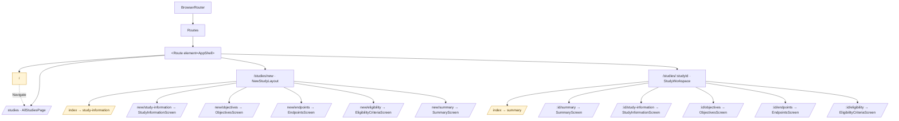
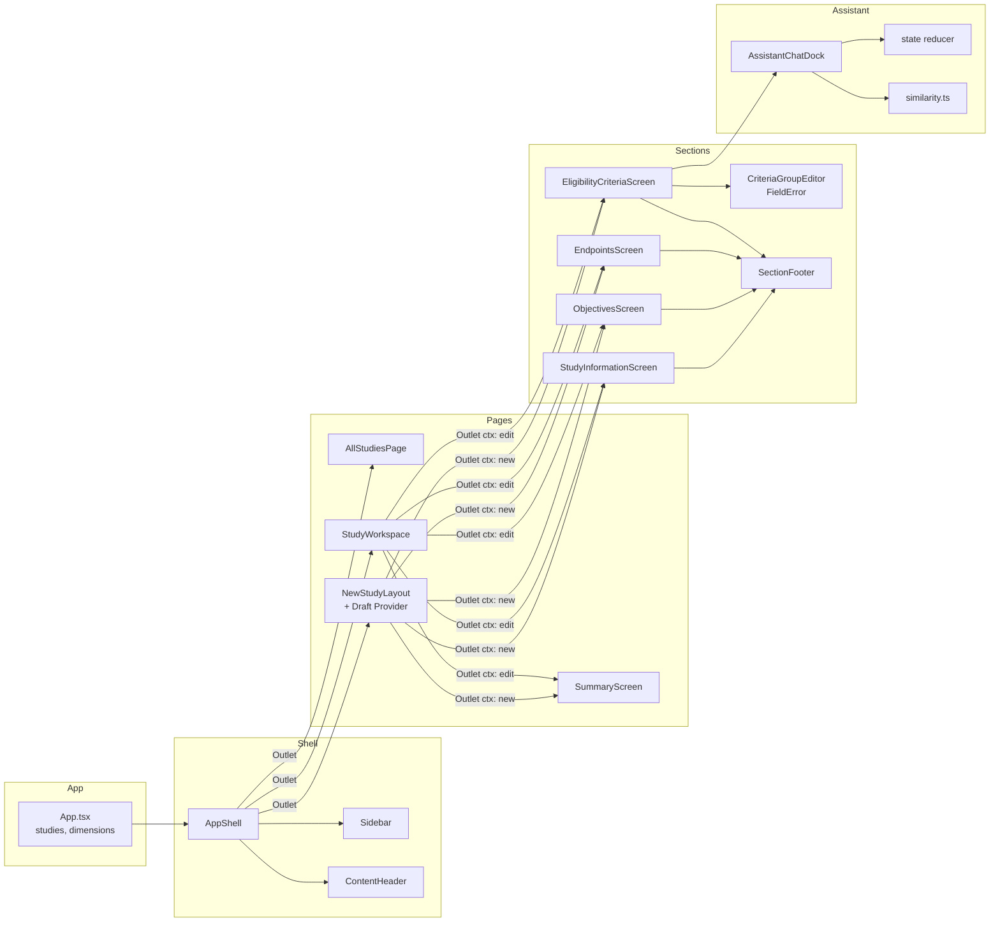
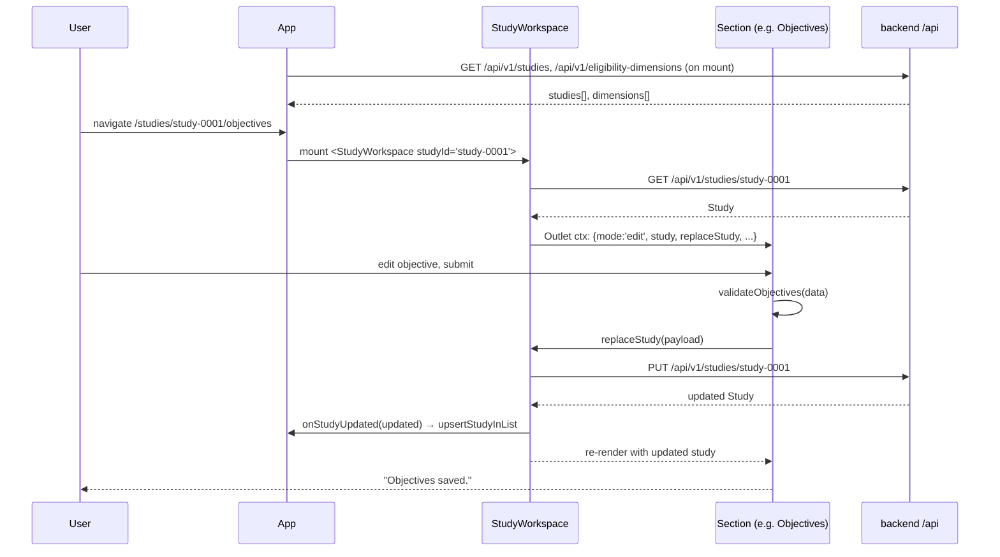
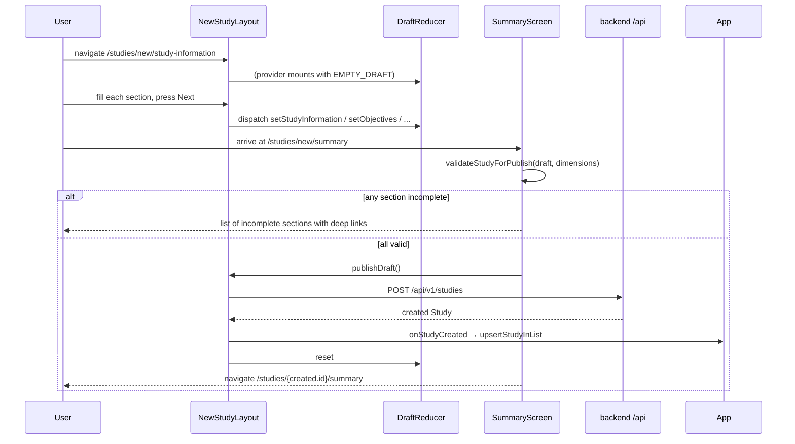
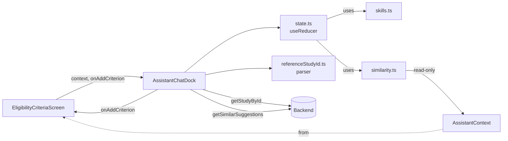

# Frontend architecture

This document describes the architecture of the `frontend/` package: its
runtime stack, how the source tree is organised, how state and data flow
through the app, and the main design choices behind the structure.

The frontend is a single-page React application that talks to the ASP.NET Core
API over a small REST surface (`/api/v1/studies`, `/api/v1/eligibility-dimensions`,
`/api/v1/studies/{id}/similar-suggestions`). It
exposes two primary flows on top of that API:

1. Browsing and filtering the registered study catalog.
2. Creating a new study via a wizard, or editing an existing one
   section-by-section.

A secondary flow — a deterministic chat-style assistant for drafting
eligibility criteria — lives in its own module but is mounted only on the
`Eligibility criteria` screen.

---

## Runtime stack

| Concern           | Choice                                        |
|-------------------|-----------------------------------------------|
| Framework         | React 19 (`StrictMode`, function components)  |
| Language          | TypeScript (bundler-mode, `verbatimModuleSyntax`) |
| Bundler / dev     | Vite 8 + `@vitejs/plugin-react`              |
| Routing           | `react-router-dom` v7 (`BrowserRouter`)       |
| Testing           | Vitest 3 + Testing Library + jsdom            |
| Lint              | ESLint 9 flat config + `typescript-eslint`    |
| Network           | Native `fetch`; Vite dev proxy `/api` → `:8080` |
| Deployment        | Static build, SPA rewrite via `vercel.json`   |

There is **no state management library** (no Redux, no Zustand, no React
Query). All state is either colocated in components, lifted to `App`, held in
a scoped `useReducer`, or exposed through a React context. See
[§ State model](#state-model).

---

## Source tree

```
frontend/
├── index.html                 Vite entry; mounts <div id="root">
├── vite.config.ts             Dev server + /api proxy to :8080
├── vitest.config.ts           jsdom environment + setup
├── vercel.json                SPA fallback rewrite
├── eslint.config.js           Flat config (recommended + react-hooks + react-refresh)
├── tsconfig*.json             Bundler-mode TS config
├── public/                    Static assets (favicon.png, icons.svg)
└── src/
    ├── main.tsx               createRoot(...).render(<StrictMode><App /></StrictMode>)
    ├── App.tsx                BrowserRouter + route tree + top-level data
    ├── api.ts                 Thin fetch wrappers, typed responses
    ├── extractErrorMessage.ts Normalise unknown errors → user-visible string
    ├── types.ts               Domain types shared with the backend contract
    ├── index.css              Design tokens + global element resets
    ├── App.css                Shell + pages + forms styles
    ├── App.test.tsx           End-to-end flows against MemoryRouter + mocked fetch
    ├── vite-env.d.ts          Vite client types
    │
    ├── shell/                 Persistent chrome (sidebar + header + <Outlet/>)
    │   ├── AppShell.tsx
    │   ├── Sidebar.tsx
    │   ├── ContentHeader.tsx
    │   └── useActiveContext.ts  URL → {none|new|edit, currentSection}
    │
    ├── pages/                 Routed feature screens
    │   ├── AllStudiesPage.tsx       /studies
    │   ├── StudyWorkspace.tsx       /studies/:studyId  (edit layout)
    │   └── SummaryScreen.tsx        /studies/new/summary and /studies/:id/summary
    │
    ├── newStudy/              Draft-only wizard glue
    │   ├── NewStudyLayout.tsx       /studies/new  (new-study layout)
    │   ├── NewStudyDraftProvider.tsx
    │   └── draftState.ts            reducer + context + useNewStudyDraft()
    │
    ├── sections/              Per-section forms, shared by new and edit
    │   ├── SectionContext.ts        useOutletContext() typed helper
    │   ├── SectionFooter.tsx        Save/Next button + messages
    │   ├── constants.ts             Section order, labels, enum options
    │   ├── validation.ts            Pure validators per section
    │   ├── StudyInformationScreen.tsx
    │   ├── ObjectivesScreen.tsx
    │   ├── EndpointsScreen.tsx
    │   ├── EligibilityCriteriaScreen.tsx
    │   ├── EligibilityEditor.tsx    Criteria table + FieldError
    │   └── eligibilityDrafts.ts     Criterion ↔ draft string form helpers
    │
    ├── assistant/             Eligibility helper (deterministic, chat-styled)
    │   ├── AssistantChatDock.tsx    FAB + drawer + thread UI
    │   ├── state.ts                 Conversation reducer
    │   ├── skills.ts                Root-menu definitions
    │   ├── types.ts                 Actions, context, turns
    │   ├── similarity.ts            Criterion equality + draft filters for copy/suggest UI
    │   ├── referenceStudyId.ts      Fuzzy id parser (e.g. "study 2" → study-0002)
    │   ├── assistant.css
    │   └── index.ts                 Narrow barrel re-export
    │
    ├── components/
    │   └── ConfirmModal.tsx         Generic confirm dialog with Esc + focus
    │
    ├── assets/                Images (hero, svg logos)
    └── test/
        └── setup.ts                 jest-dom matchers for Vitest
```

---

## Routing and navigation

All navigation is driven by `react-router-dom` and expressed as a nested
route tree rooted at `App.tsx`. The `AppShell` layout is the outer `<Outlet>`
so the sidebar and content header are preserved across every screen.



Both the new-study and edit flows reuse the **same section components**
(`StudyInformationScreen`, `ObjectivesScreen`, `EndpointsScreen`,
`EligibilityCriteriaScreen`, `SummaryScreen`). The component discriminates
between modes by reading a typed outlet context (see
[§ Section context](#section-context-the-polymorphic-contract)).

`shell/useActiveContext.ts` parses `location.pathname` into a discriminated
union so the shell doesn't need to know about React Router internals:

```ts
type ActiveContext =
  | { kind: 'none' }
  | { kind: 'new'; currentSection: SectionSlug | null }
  | { kind: 'edit'; studyId: string; currentSection: SectionSlug | null }
```

The sidebar and the content header both consume this value to drive their
labels, outline links and the "Unpublished draft" badge.

---

## Component topology



The dashed "Outlet ctx" edges are typed React Router outlet contexts. Each
layout constructs the context value and passes it down implicitly; sections
read it via `useSectionContext()` without needing explicit props.

---

## State model

State is deliberately split by lifetime and ownership:

```mermaid
flowchart TB
    subgraph App
        AS1["studies: Study[]"]
        AS2["dimensions: EligibilityDimension[]"]
        AS3[loadError, isLoadingList, ...]
    end

    subgraph StudyWorkspace (edit)
        SW1[study: Study | null]
        SW2[isLoadingStudy, loadError]
    end

    subgraph NewStudyDraftProvider (new)
        DR[draft: NewStudyDraft\nuseReducer]
    end

    subgraph AssistantChatDock
        ASS[AssistantState\nuseReducer]
        LS[lookupStudies]
        OP[isOpen, footerValue]
    end

    subgraph Section forms
        FS[form fields\nvalidationErrors\nuseState]
    end

    AS1 -.passed via props.-> ASP[AllStudiesPage]
    AS2 -.passed via props.-> NSL & SW
    SW1 -.outlet ctx.-> Sections
    DR  -.outlet ctx.-> Sections
    FS  -- validated by --> VAL[sections/validation.ts]
```

### Top-level state — `App.tsx`

`App` owns two pieces of shared state:

- `studies` — the registered study catalog. Seeded once at mount, then
  mutated via `upsertStudyInList` whenever a section saves or publishes.
- `dimensions` — the eligibility dimension catalog, used by the eligibility
  screen and by the assistant's similarity scoring.

Both are fetched lazily with matching `isLoading*`/`*Error` flags. The
callbacks (`refreshStudies`, `refreshDimensions`, `upsertStudyInList`) are
forwarded to the pages that need them.

### Workspace state — edit mode

`StudyWorkspace` owns the currently-loaded study (`study`, `isLoadingStudy`,
`loadError`) plus the mutating operations (`replaceStudy`,
`updateEligibility`). These are exposed to all five section screens through
its outlet context.

### Wizard state — new mode

`NewStudyDraftProvider` owns the **draft** via a `useReducer` with four
section buckets and a `reset` action. The reducer keeps each section's data
in its already-validated shape (`StudyInformationData`, `ObjectivesData`,
etc.) so the `SummaryScreen` can run `validateStudyForPublish` without any
extra transformation.

```ts
interface NewStudyDraft {
  studyInformation: StudyInformationData
  objectives: ObjectivesData
  endpoints: EndpointsData
  eligibility: EligibilityData
}
```

The provider is mounted exclusively under `/studies/new`, so navigating away
unmounts it and the draft is naturally discarded.

### Form state — per section

Each section form keeps its input state in `useState`, runs its matching
validator (`validateStudyInformation`, `validateObjectives`, …) and, on
submit, either:

- In **new** mode: pushes the validated value into the draft and navigates to
  `nextSection`.
- In **edit** mode: `PUT`s the payload via `replaceStudy` / `updateEligibility`
  and renders success or API-validation errors.

Server-returned validation errors (`ApiErrorResponse.errors`) are reused as
the form's `validationErrors` map so users see the same field-level messages
whether the check fired client-side or server-side.

### Assistant state

The assistant keeps its conversation entirely in a `useReducer` local to
`AssistantChatDock` (see [§ Assistant module](#assistant-module)). It never
persists to the backend.

---

## Data flow: edit an existing study



## Data flow: publish a new study



---

## API layer (`src/api.ts`)

A deliberately thin wrapper around `fetch`:

- `apiUrl(path)` prefixes the path with `VITE_API_URL` when it is set
  (production build on Vercel hitting fly.io), otherwise returns the path
  unchanged so the Vite dev proxy can forward `/api` to `localhost:8080`.
- Successful responses from the API use a **`{ data: T }` envelope**; each
  wrapper unwraps `data` before returning `T` to the rest of the app.
- `parseResponse<T>` reads the response body, parses JSON when present, and
  returns `T` on 2xx. On **non-2xx** it **throws the parsed object** when the
  body is JSON so callers can narrow to `ApiErrorResponse` and surface
  `errors` per-field. **Empty bodies**, **invalid JSON**, and **non-JSON error
  bodies** throw a minimal `{ message }` shape instead of a raw `SyntaxError`.
- The exported surface is: `listStudies`, `getStudyById`, `createStudy`,
  `replaceStudy`, `updateStudyEligibility` (`PUT` to
  `/api/v1/studies/{id}/eligibility`), `listEligibilityDimensions`, and
  `getSimilarSuggestions` (assistant; `GET` with `limit` query).

There is no client-side cache layer; re-fetches are explicit and callers
decide when to refresh.

`App.tsx` uses `extractErrorMessage` from `extractErrorMessage.ts` when a
catalog fetch fails so list/dimension errors always show a readable string.

---

## Section context: the polymorphic contract

The key abstraction that lets one set of section components serve both the
wizard and the edit workspace is the typed outlet context:

```ts
type SectionOutletContext = EditSectionContext | NewSectionContext

interface EditSectionContext {
  mode: 'edit'
  studyId: string
  study: Study | null
  isLoadingStudy: boolean
  loadError: string
  replaceStudy: (input: StudyCreateInput) => Promise<Study>
  updateEligibility: (input: StudyEligibilityInput) => Promise<Study>
  // + dimensions, isLoadingDimensions, dimensionsError, refreshDimensions
}

interface NewSectionContext {
  mode: 'new'
  draft: NewStudyDraft
  setStudyInformation / setObjectives / setEndpoints / setEligibility
  publishDraft: () => Promise<Study>
  discardDraft: () => void
  // + dimensions, isLoadingDimensions, dimensionsError, refreshDimensions
}
```

Each section uses `ctx.mode` as a discriminant. The `SectionFooter` renders
`Save` in edit mode and `Next` in new mode; the summary screen is the same
component but takes an entirely different branch at the top (`EditSummary`
vs `NewStudySummary`).

This keeps the section files focused on **what the user sees and what rules
apply** — not on routing, persistence or draft transport.

---

## Validation model (`sections/validation.ts`)

Validators are **pure functions** returning `Record<string, string>` where
keys are field paths (`objectives[0]`, `inclusionCriteria[1].deterministicRule.unit`)
and values are user-facing messages.

- Each section has its own validator: `validateStudyInformation`,
  `validateObjectives`, `validateEndpoints`, `validateEligibility`.
- `validateStudyForPublish` runs all four and returns a section-keyed map of
  errors — used by the summary screen to list incomplete sections and link
  back to them.
- The same map shape is produced by the backend's `ApiErrorResponse.errors`,
  so client and server errors plug into the same `FieldError` rendering path.

Constants backing validation are centralised in `sections/constants.ts`
(phase options, therapeutic areas, study types, section order, section
labels, slug type guard).

---

## Eligibility criterion editing (`sections/EligibilityEditor.tsx` + `eligibilityDrafts.ts`)

`EligibilityCriterion` on the wire is a strict shape (numeric `value`,
constrained `operator`, `dimensionId` referencing a catalog). While editing,
the UI needs partial/invalid states (empty strings, in-progress numbers,
unselected dimension). The solution is a **draft form** type:

```ts
interface CriterionDraft {
  description: string
  dimensionId: string
  operator: DraftOperator   // RuleOperator | ''
  value: string             // string so the input can be empty or partial
  unit: string
}
```

`criteriaToDrafts` and `draftsToCriteria` convert between the persisted
shape and the editable shape. The `CriteriaGroupEditor` renders the table,
auto-selecting the first allowed unit of a dimension when the user changes
the dimension selector.

---

## Assistant module

The `assistant/` folder is a self-contained widget that plugs into the
`EligibilityCriteriaScreen` via props. It is intentionally **not AI**: the
chat is a deterministic state machine; **similar-study suggestions** are
ranked on the server (see [`assistant-heuristic.md`](./assistant-heuristic.md)),
while the browser handles criterion deduplication, copy-from-study menus, and
local draft filtering in `similarity.ts`.

### Module internals



### Conversation state machine

The conversation is an array of `AssistantTurn`s plus a currently-active
`prompt` (the menu waiting for a click). Everything is produced by the
reducer in `state.ts`, driven by `AssistantAction`s:

```
START_COPY_FROM_STUDY
  → prompt: "enter study id"
  → REFERENCE_STUDY_RESOLVED → show criteria of that study
  → COPY_CRITERION → host adds it to the draft, same picker rerenders

START_SUGGEST_RELEVANT
  → GET similar-suggestions (server-ranked)
  → filter against local draft, show up to 3 picks
  → ACCEPT_SUGGESTION → host adds, prompt "suggest three more" / back

BACK_TO_MAIN everywhere returns to the root skill menu.
```

A few patterns worth noting:

- **Disable-don't-delete**: superseded menus render as disabled so the
  thread reads as a chronological log.
- **Host side-effects** (adding a criterion to the draft) run *before* the
  reducer, so the new menu is computed against the up-to-date draft without
  waiting for a parent re-render. The reducer also builds an *augmented
  local context* after a copy so same-tick follow-up menus already reflect
  the addition.
- **Copy-from-study**: the host passes `otherStudies: []`; after the user
  types a study id, `AssistantChatDock` calls `getStudyById` and merges the
  result into `lookupStudies` for the rest of the session (drawer open).
- **Reference id parser** (`referenceStudyId.ts`) normalises `"study 2"`,
  `"Study-02"`, `"  study/0012"` etc. to the canonical `study-0002` form.

---

## Styling

Styling is plain CSS split into three files:

- `index.css` — design tokens (font sizes, weights, base colours) on `:root`
  plus element-level resets.
- `App.css` — layout of the shell, pages, forms, summary grid, tables and
  modal (~600 lines).
- `assistant/assistant.css` — the FAB, drawer, thread bubbles and menu.

No CSS-in-JS, no Tailwind, no pre-processor. All class names are plain
strings scoped semantically (`.app-shell`, `.workspace-content`,
`.study-card`, `.assistant-drawer`, …). This keeps the bundle small and the
DOM inspectable without a build toolchain in the way.

---

## Testing strategy

```
src/
├── App.test.tsx                        High-level flows: navigate, list, filter,
│                                       publish, edit, assistant integration
├── api.test.ts                         `{ data }` envelope + similar-suggestions parsing
├── sections/
│   ├── validation.test.ts              Pure validators (happy + edge cases)
│   └── eligibilityDrafts.test.ts       Draft ↔ criterion conversions
└── assistant/
    ├── similarity.test.ts              Criterion equality + draft filters
    ├── state.test.ts                   Reducer transitions end-to-end
    ├── referenceStudyId.test.ts        ID parser (messy input → canonical)
    └── AssistantChatDock.test.tsx      Dock rendering + interaction
```

- Uses **`vi.stubGlobal('fetch', ...)` pattern** in `App.test.tsx` to avoid
  MSW setup — payloads are returned as plain `Response`-like objects.
- Pure modules (`validation.ts`, `similarity.ts`, `referenceStudyId.ts`,
  `state.ts`) are covered with unit tests; interactive modules are covered
  with Testing Library flows.
- `MemoryRouter` is used in tests to drive routing without a DOM history.

---

## Build and deployment

- `pnpm dev` — Vite dev server on `:5173` with `/api` proxied to
  `localhost:8080`. HMR on.
- `pnpm run build` — `tsc -b` type-check, then `vite build` to `dist/`.
- `pnpm run preview` — static preview of the built bundle.
- `vercel.json` rewrites every path back to `/index.html` so React Router
  owns client-side routing in production.
- `VITE_API_URL` (at build time) selects the remote backend; if empty, the
  app assumes a same-origin `/api`.

---

## Key design choices (and why)

### 1. Section components shared between new and edit

Every section screen is rendered both under `/studies/new/<section>` and
`/studies/:studyId/<section>`. Two small layouts (`NewStudyLayout`,
`StudyWorkspace`) own the *transport* — draft reducer vs. server round
trip — and expose a **discriminated outlet context** so the sections only
need to know whether they are staging to the draft or persisting to the
server.

Alternatives considered:

- Two parallel trees of section components — rejected: duplication and drift.
- A single "god" page with local state for both cases — rejected: harder to
  test and harder to read, because edit and new have different failure and
  persistence modes.

The chosen approach keeps the validator, the markup and the labels in one
place, and isolates the small set of behaviours that actually differ.

### 2. No global store

All state that genuinely spans routes is either held by `App` and passed as
props (`studies`, `dimensions`) or scoped to a layout route
(`NewStudyDraftProvider`, `StudyWorkspace`'s local state). Forms keep their
input state local.

This removes an entire dependency layer (no store, no selectors, no
middlewares) at the cost of a few explicit prop chains. For a single-page
POC with well-defined data ownership it is a net win; everything that needs
to react to a change does so through normal React re-renders and typed props
without indirection.

### 3. Draft via `useReducer`, not form libraries

The new-study draft is a `useReducer` with four action types. No Formik, no
React Hook Form, no Zod. The draft's shape matches the validators' input
shape, so `SummaryScreen` can run `validateStudyForPublish(draft)` directly
without an intermediate schema.

Trade-off: individual field wiring is a little more verbose than a form
library would be. Pay-off: the draft is trivially serialisable, trivially
testable, and the submit path is a straight `ctx.publishDraft()`.

### 4. Draft form type for eligibility rows

`CriterionDraft` decouples what the user can type (empty numbers, unselected
dimensions) from what the API accepts. Without this split, inputs would need
a lot of defensive rendering code (`value={criterion.value ?? ''}`,
`value={String(criterion.value)}`) and would be prone to silent type bugs.
Conversion happens exactly twice, at the boundary of the section component.

### 5. Deterministic assistant instead of an LLM

The assistant is a closed-menu conversation driven by a state-machine reducer;
similar-study suggestions use a **server-side** heuristic (therapeutic area /
phase / study type / shared dimensions). Choosing this over an LLM for the POC:

- Keeps the UX honest about what the widget can and cannot do.
- Removes provider selection, API key handling, prompt engineering and
  hallucination mitigation from the critical path.
- Leaves replacement cheap: the `AssistantAction` surface and the state
  reducer do not know whether suggestions come from a heuristic or a model,
  so swapping `similarity.ts` for a service call is a localised change.

### 6. URL-driven active context

Both the sidebar and the content header consume
`useActiveContext()`, which derives its state from `useLocation().pathname`.
No context provider. No event bus. This means:

- Deep links always render correctly.
- Back/forward navigation needs no extra state plumbing.
- Tests can drive navigation purely by setting `initialEntries` on a
  `MemoryRouter`.

### 7. Error payload as first-class UI data

`api.ts` throws the parsed error payload (not a generic `Error`) on non-2xx
responses. Section forms catch it, pull `ApiErrorResponse.errors`, and feed
it directly into their `validationErrors` state. Client-side and server-side
validation therefore share exactly one rendering path (`FieldError`) and
exactly one data shape, which keeps the UX predictable regardless of where
an error was produced.

### 8. Lazy, opt-in data fetches

- Main catalog and dimension catalog fetch on `App` mount (they are needed
  for both the list and for eligibility editing).
- The edit workspace fetches its study only when the route is mounted.
- The assistant does **not** prefetch the full study catalog; copy-from-study
  loads a single study by id when the user submits it.

The cost of each fetch is therefore paid when a user actually needs the
data, not on every cold start of the SPA.
